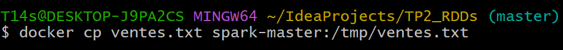
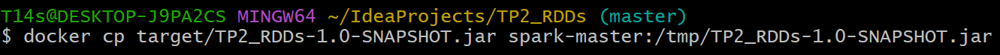
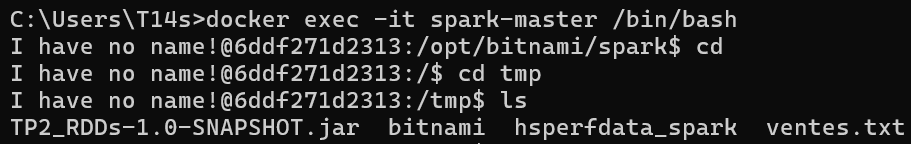
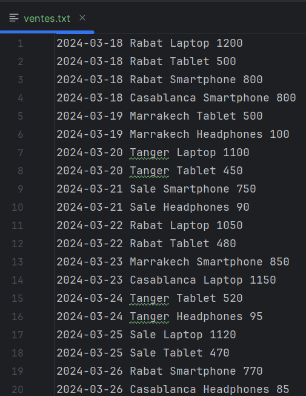
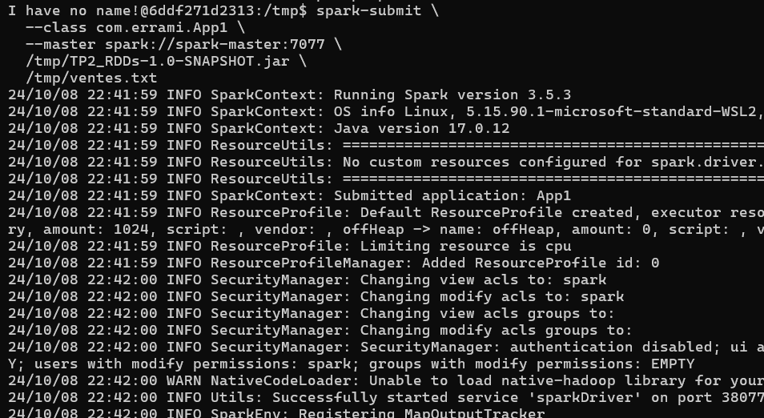
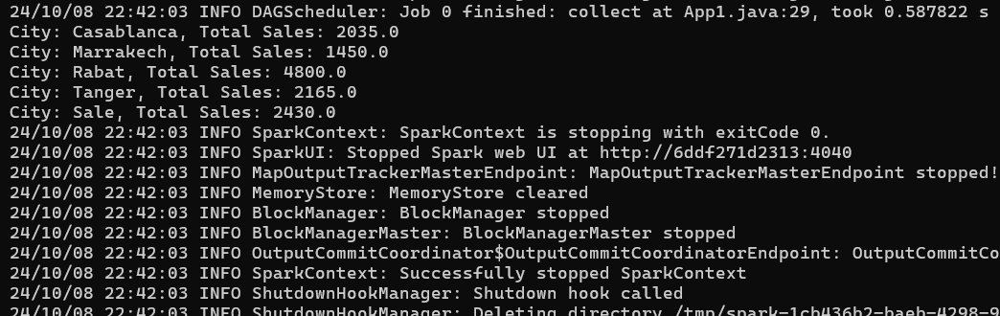
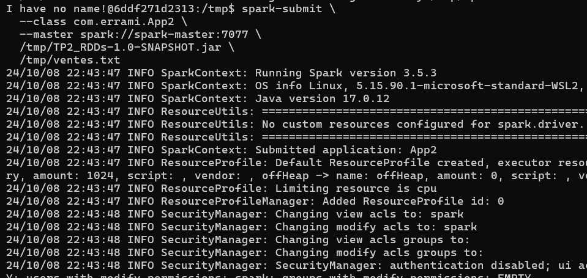
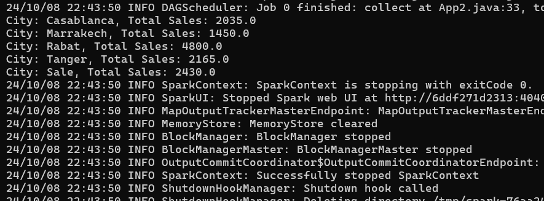

# Programmation des RDDs avec Spark

## Introduction

Dans ce travail, nous allons travailler avec les RDDs (Resilient Distributed Datasets) de Spark. Nous allons développer deux applications Spark permettant de traiter un fichier texte contenant les ventes d’une entreprise dans les différentes villes.

## Structure du projet
```
   src
    ├───main
    │   ├───java
    │   │   └───com
    │   │       └───makhchan
    │   │           ├───App1
    │   │           └───App2
    │   │
    │   └───resources
    └───test
        └───java
    │
    ├───docker-compose.yml
    ├───pom.xml
    ├───ventes.txt
    ...
```

### Configuration
- Cloner le dépôt git :
```
git clone https://github.com/younes-makhchan/big-data-tps
```
- Accéder au répertoire du projet :
```
cd Application-simple-de-programmation-des-RDDs
```

### Démarrer le docker compose :
```
docker-compose up
```

### Objectifs

À partir d’un fichier texte (ventes.txt), contenant les ventes d’une entreprise dans les différentes villes, on souhaite développer le 1er application Spark permettant de déterminer le total des ventes par ville et la 2ème application permettant de calculer le prix total des ventes des produits par ville pour une année donnée, le fichier texte (ventes.txt) y compris la date, la ville, le produit et le prix. Les données sont stockées dans le format suivant :
```
date ville produit prix
```

1. Code source du App1 (Tâche 1 : Calculer les ventes totales par ville)
```java
public class App1 {
    public static void main(String[] args) throws Exception {
        // Initialize Spark context
        SparkConf conf = new SparkConf().setAppName("App1").setMaster("local");
        JavaSparkContext sc = new JavaSparkContext(conf);

        // Load the data
        JavaRDD<String> data = sc.textFile("./ventes.txt");

        // Split each line and map city with price
        JavaPairRDD<String, Double> salesByCity = data
                .mapToPair(line -> {
                    String[] fields = line.split(" ");
                    String city = fields[1];
                    double price = Double.parseDouble(fields[3]);
                    return new Tuple2<>(city, price);
                })
                .reduceByKey(Double::sum);  // Aggregate the sales by city

        // Collect and print the result
        salesByCity.collect().forEach(tuple ->
                System.out.println("City: " + tuple._1() + ", Total Sales: " + tuple._2())
        );

        // Stop the Spark context
        sc.stop();
    }
}
```

2. Code source du App2 (Tâche 2 : Calculer les ventes totales par ville pour une année donnée)

```java
public class App2 {
   public static void main(String[] args) throws Exception {
       // Initialize Spark context
       SparkConf conf = new SparkConf().setAppName("App2").setMaster("local");
       JavaSparkContext sc = new JavaSparkContext(conf);

       // Year to filter by (example: 2024)
       String targetYear = "2024";

       // Load the data
       JavaRDD<String> data = sc.textFile("./ventes.txt");

       // Split each line, filter by year, and map city with price
       JavaPairRDD<String, Double> salesByCityForYear = data
               .filter(line -> line.startsWith(targetYear)) // Filter by the year
               .mapToPair(line -> {
                   String[] fields = line.split(" ");
                   String city = fields[1];
                   double price = Double.parseDouble(fields[3]);
                   return new Tuple2<>(city, price);
               })
               .reduceByKey(Double::sum);  // Aggregate the sales by city

       // Collect and print the result
       salesByCityForYear.collect().forEach(tuple ->
               System.out.println("City: " + tuple._1() + ", Total Sales: " + tuple._2())
       );

       // Stop the Spark context
       sc.stop();
   }
}
```

3. Copier ventes.txt et le jar dans le conteneur spark-master :





4. Test avec la list des ventes




5. Execution

- Tâche 1
```
spark-submit \
  --class com.makhchan.App1 \
  --master spark://spark-master:7077 \
  /tmp/TP2_RDDs-1.0-SNAPSHOT.jar \
  /tmp/ventes.txt
```

- Résultat





- Tâche 2
```
spark-submit \
  --class com.makhchan.App2 \
  --master spark://spark-master:7077 \
  /tmp/TP2_RDDs-1.0-SNAPSHOT.jar \
  /tmp/ventes.txt
```

- Résultat



