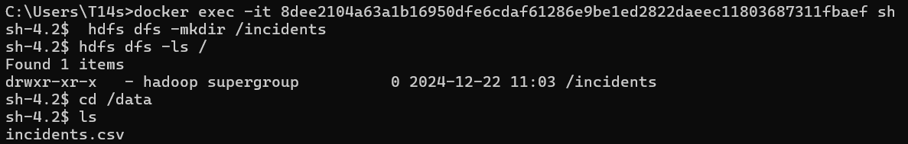
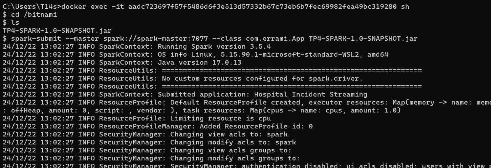
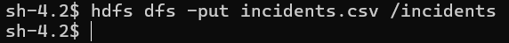
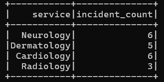
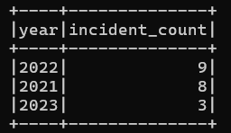

# Simple Hospital Incidents Spark Structured Streaming Application

This is a simple Spark application that receives the hospital incidents in streaming with **Structured Streaming**. The incidents are received in streaming in csv files. The data format in the csv files is the following:
```
Id, titre, description, service, date
```

## Project Structure
```
   src
    ├───main
    │   ├───java
    │   │   └───com
    │   │       └───makhchan
    │   │           └───App
    │   │
    │   └───resources
    └───test
        └───java
```

## Functionalities
- Read the csv files in streaming
- Parse the csv files
- Filter the incidents by service
- Count the number of incidents by service
- Count the number of incidents by date

## Run the application
1. Clone the repository :
```
git clone https://github.com/younes-makhchan/big-data-tps
cd Hospital-Incident-Streaming-App
```
2. Run the docker-compose file :
```
docker-compose up -d
```
3. Move the incidents.cvs file in the generated folder volumes/namenode.
4. Build the project and move the jar file to the generated folder volumes/spark-master.

5. In the namenode container, make this commands :
```
hdfs dfs -mkdir /incidents
cd /data
```


6. In the spark-master container, make this commands :
```
cd /bitname
spark-submit --master spark://spark-master:7077 --class com.makhchan.App <jar file>
```

7. In the namenode container, make this commands :
```
hdfs dfs -put incidents.csv /incidents
```


## Results (in the spark-master container)
1. Count the number of incidents by service :



2. Count the number of incidents by date :

