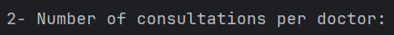

# SPARK SQL

## Introduction

Cette application est un exemple d'utilisation de Spark SQL pour traiter des données. Elle contient deux exercices :

## Structure du projet

```
   src
    ├───main
    │   ├───java
    │   │   └───com
    │   │       └───makhchan
    │   │           ├───App1
    │   │           └───App2
    │   │
    │   └───resources
    └───test
        └───java
```

## Exercice 1 : Traitement de données des incidents

### Objectif

On souhaite développer pour une entreprise industrielle une application Spark qui traite les incidents de chaque service. Les incidents sont stockés dans un fichier csv.
Le format de données dans les fichiers csv et la suivante :
    
```
id, titre, description, service, date
```

### Travail à faire

1. Afficher le nombre d’incidents par service.
2. Afficher les deux années où il a y avait plus d’incidents.

### Solution

1. Code source du 1er App
    
```java
public class App1 {
    public static void main(String[] args) {

        // Initialize Spark session
        SparkSession spark = SparkSession.builder()
                .appName("IncidentAnalysis")
                .master("local")
                .getOrCreate();

        // Set the time parser policy to LEGACY
        spark.conf().set("spark.sql.legacy.timeParserPolicy", "LEGACY");

        // Load the CSV file
        Dataset<Row> incidentsDF = spark.read()
                .option("header", "true")  // CSV has a header
                .option("inferSchema", "true")  // Infer the schema from data
                .csv("./incidents.csv");

        // Show the data
        incidentsDF.show();

        // 1. Display the number of incidents per service
        Dataset<Row> incidentsPerService = incidentsDF.groupBy("service")
                .count()
                .orderBy(functions.desc("count"));

        System.out.println("Number of incidents per service:");
        incidentsPerService.show();

        // 2. Display the two years with the most incidents
        Dataset<Row> incidentsPerYear = incidentsDF
                .withColumn("parsed_date", functions.to_date(incidentsDF.col("date"), "MM/dd/yyyy"))  // Parse the date with specified format
                .withColumn("year", functions.year(functions.col("parsed_date")))  // Extract year from parsed date
                .groupBy("year")
                .count()
                .orderBy(functions.desc("count"));

        System.out.println("Years with the most incidents:");
        incidentsPerYear.show(2);

        // Stop the Spark session
        spark.stop();
    }
}
```

2. Resultat de l'execution


## Exercice 2 : Traitement de données d'un hôpital

### Objectif

L’objectif est de traiter ces données en utilisant Spark SQL à travers les APIs DataFrame et Dataset pour extraire des informations utiles afin de prendre des décisions.
Les données sont stockées dans une base de données MYSQL nommée **DB_HOPITAL**, qui contient trois tables **PATIENTS**, **MEDECINS** et **CONSULTATIONS** :

1. Table **PATIENTS** :
    


2. Table **MEDECINS** :


3. Table **CONSULTATIONS** :


Pour créer la base de données **DB_HOPITAL** et les tables, on peut exécuter le script SQL suivant :

```sql
CREATE DATABASE DB_HOPITAL;
USE DB_HOPITAL;

CREATE TABLE PATIENTS (
    id INT PRIMARY KEY AUTO_INCREMENT,
    nom VARCHAR(50) NOT NULL,
    prenom VARCHAR(50) NOT NULL,
    cin VARCHAR(50) NOT NULL,
    tel VARCHAR(50) NOT NULL,
    email VARCHAR(50) NOT NULL,
    date_naissance DATE NOT NULL
);

CREATE TABLE MEDECINS (
    id INT PRIMARY KEY AUTO_INCREMENT,
    nom VARCHAR(50) NOT NULL,
    prenom VARCHAR(50) NOT NULL,
    email VARCHAR(50) NOT NULL,
    tel VARCHAR(50) NOT NULL,
    specialite VARCHAR(50) NOT NULL
);

CREATE TABLE CONSULTATIONS (
    id INT PRIMARY KEY AUTO_INCREMENT,
    id_medecin INT NOT NULL,
    id_patient INT NOT NULL,
    date_consultation DATE NOT NULL,
    FOREIGN KEY (id_medecin) REFERENCES MEDECINS(id),
    FOREIGN KEY (id_patient) REFERENCES PATIENTS(id)
);
```
Et pour insérer des données dans les tables, on peut exécuter les requêtes SQL suivantes :

```sql
INSERT INTO PATIENTS (NOM, PRENOM, CIN, TEL, EMAIL, DATE_NAISSANCE) VALUES
('patient1', 'patient1', 'X123456', '0612345678', 'patient1@example.com', '1980-05-14'),
('patient2', 'patient2', 'X654321', '0612349876', 'patient2@example.com', '1972-09-01'),
('patient3', 'patient3', 'X123457', '0612345689', 'patient3@example.com', '1995-10-20'),
('patient4', 'patient4', 'X987654', '0612349999', 'patient4@example.com', '1989-12-01'),
('patient5', 'patient5', 'X456789', '0612333333', 'patient5@example.com', '1991-07-15'),
('patient6', 'patient6', 'X789123', '0612322222', 'patient6@example.com', '1999-11-30'),
('patient7', 'patient7', 'X987321', '0612311111', 'patient7@example.com', '1987-02-15'),
('patient8', 'patient8', 'X543210', '0612398765', 'patient8@example.com', '1993-03-22'),
('patient9', 'patient9', 'X678912', '0612300000', 'patient9@example.com', '1977-06-10'),
('patient10', 'patient10', 'X543219', '0612399999', 'patient10@example.com', '1982-04-09');

INSERT INTO MEDECINS (NOM, PRENOM, EMAIL, TEL, SPECIALITE) VALUES
('medecin1', 'medecin1', 'medecin1@hospital.com', '0601010101', 'Cardiologist'),
('medecin2', 'medecin2', 'medecin2@hospital.com', '0602020202', 'Dermatologist'),
('medecin3', 'medecin3', 'medecin3@hospital.com', '0603030303', 'Neurologist'),
('medecin4', 'medecin4', 'medecin4@hospital.com', '0604040404', 'Pediatrician'),
('medecin5', 'medecin5', 'medecin5@hospital.com', '0605050505', 'Orthopedic Surgeon'),
('medecin6', 'medecin6', 'medecin6@hospital.com', '0606060606', 'General Practitioner'),
('medecin7', 'medecin7', 'medecin7@hospital.com', '0607070707', 'Oncologist'),
('medecin8', 'medecin8', 'medecin8@hospital.com', '0608080808', 'Radiologist'),
('medecin9', 'medecin9', 'medecin9@hospital.com', '0609090909', 'Psychiatrist'),
('medecin10', 'medecin10', 'medecin10@hospital.com', '0610101010', 'Urologist');

INSERT INTO CONSULTATIONS (ID_MEDECIN, ID_PATIENT, DATE_CONSULTATION) VALUES
(1, 1, '2023-10-01'),
(1, 2, '2023-10-02'),
(1, 2, '2023-10-05'),
(2, 3, '2023-10-01'),
(2, 4, '2023-10-03'),
(2, 4, '2023-10-07'),
(3, 5, '2023-10-04'),
(3, 6, '2023-10-06'),
(4, 7, '2023-10-01'),
(4, 8, '2023-10-07'),
(4, 8, '2023-10-09'),
(5, 9, '2023-10-02'),
(5, 10, '2023-10-05'),
(5, 9, '2023-10-09'),
(6, 1, '2023-10-01'),
(6, 2, '2023-10-10'),
(7, 3, '2023-10-03'),
(7, 5, '2023-10-06'),
(8, 6, '2023-10-07'),
(8, 9, '2023-10-08'),
(9, 7, '2023-10-01'),
(9, 10, '2023-10-10'),
(10, 8, '2023-10-01'),
(10, 4, '2023-10-05');
```

### Travail à faire

1. Afficher le nombre de consultations par jour.
2. Afficher le nombre de consultation par médecin. Le format d’affichage est le suivant :
   NOM | PRENOM | NOMBRE DE CONSULTATION
3. Afficher pour chaque médecin, le nombre de patients qu’il a assisté.

### Solution

1. Code source du 2eme App
    
```java
public class App2 {
    public static void main(String[] args) {
        // Initialize SparkSession
        SparkSession spark = SparkSession.builder()
                .appName("Hospital Data Analysis")
                .master("local[*]")
                .getOrCreate();

        // MySQL JDBC connection properties
        String jdbcUrl = "jdbc:mysql://localhost:3306/DB_HOPITAL";
        String user = "root";
        String password = "";

        // Load Patients, Medecins, and Consultations tables into DataFrames
        Dataset<Row> patientsDf = spark.read()
                .format("jdbc")
                .option("url", jdbcUrl)
                .option("dbtable", "PATIENTS")
                .option("user", user)
                .option("password", password)
                .load();

        Dataset<Row> medecinsDf = spark.read()
                .format("jdbc")
                .option("url", jdbcUrl)
                .option("dbtable", "MEDECINS")
                .option("user", user)
                .option("password", password)
                .load();

        Dataset<Row> consultationsDf = spark.read()
                .format("jdbc")
                .option("url", jdbcUrl)
                .option("dbtable", "CONSULTATIONS")
                .option("user", user)
                .option("password", password)
                .load();

        // 1. Display the number of consultations per day
        System.out.println("Number of consultations per day:");
        consultationsDf.groupBy("date_consultation")
                .count()
                .orderBy("date_consultation")
                .show();

        // 2. Display the number of consultations per doctor (NOM | PRENOM | NOMBRE DE CONSULTATION)
        System.out.println("Number of consultations per doctor:");
        Dataset<Row> medecinConsultationCount = consultationsDf
                .join(medecinsDf, consultationsDf.col("id_medecin").equalTo(medecinsDf.col("id")))
                .groupBy("nom", "prenom")
                .count()
                .withColumnRenamed("count", "nombre_de_consultations");

        medecinConsultationCount
                .select("nom", "prenom", "nombre_de_consultations")
                .orderBy("nombre_de_consultations")
                .show();

        // 3. Display for each doctor, the number of distinct patients he has assisted
        System.out.println("Number of distinct patients per doctor:");
        Dataset<Row> medecinPatientsCount = consultationsDf
                .join(medecinsDf, consultationsDf.col("id_medecin").equalTo(medecinsDf.col("id")))
                .groupBy("nom", "prenom")
                .agg(functions.countDistinct("id_patient").alias("nombre_de_patients"));

        medecinPatientsCount
                .select("nom", "prenom", "nombre_de_patients")
                .orderBy("nombre_de_patients")
                .show();

        // Stop the Spark session
        spark.stop();
    }
}
```

2. Resultat de l'execution





