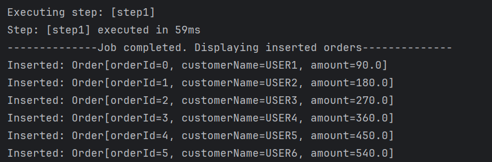
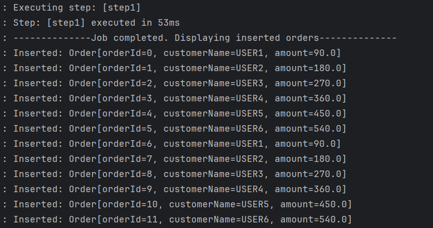

# Simple Spring Batch Orders Processing Application

The objective of this application is to create a Spring Batch job that processes a list of orders from a CSV file. Each order contains an ID, a customer name and an amount. The job should transform the data by applying a discount on the amount and write the updated orders to a database HSQLDB.

## Project Structure
```
   src
    ├───main
    │   ├───java
    │   │   └───com
    │   │       └───makhchan
    │   │           └───springbatchorderprocessor
    │   │               ├───BatchConfiguration.java
    │   │               ├───JobCompletionNotificationListener.java
    │   │               ├───Order.java
    │   │               ├───OrderItemProcessor.java
    │   │               ├───OrderJobScheduler.java
    │   │               └───SpringBatchOrderProcessorApplication.java
    │   └───resources
    │       ├───orders.csv
    │       ├───schema.sql
    │       └───application.properties
    └───test
        └───java
```

## Prerequisites
- Java 17
- Spring Boot
- Spring Batch
- HSQLDB

## Clone the repository
```bash
git clone https://github.com/younes-makhchan/big-data-tps
cd Spring-Batch-Order-Processor-Application
```

## Functionality
- **Reading**: Data is read from a CSV file orders.csv.
- **Processing**: A 10% discount is applied to the amount of the orders.
- **Writing**: The processed orders are inserted into the orders table of the HSQLDB database.
- **Scheduling**: The Batch job is scheduled to run at regular intervals with @Scheduled.

## Tasks done
1. Create a CSV file orders.csv: This file contains the initial orders with the columns: orderId, customerName, amount :
```
orderId,customerName,amount
1,user1,100.0
2,user2,200.0
3,user3,300.0
4,user4,400.0
5,user5,500.0
6,user6,600.0
```

2. Read orders from CSV file with FlatFileItemReader :
```java
@Bean
public FlatFileItemReader<Order> reader() {
    return new FlatFileItemReaderBuilder<Order>()
            .name("orderItemReader")
            .resource(new ClassPathResource("orders.csv"))
            .delimited()
            .names("orderId", "customerName", "amount")
            .linesToSkip(1)
            .targetType(Order.class)
            .build();
}
```

3. Transform Data: Apply a 10% discount on the amount (amount) for each order :
```java
public class OrderItemProcessor implements ItemProcessor<Order, Order> {
    @Override
    public Order process(Order item) {
        Double discountedAmount = item.amount() * 0.9;
        String customerName = item.customerName().toUpperCase();

        return new Order(item.orderId(), customerName, discountedAmount);
    }
}
```

4. Write the transformed commands to an HSQLDB database :
```java
@Bean
public JdbcBatchItemWriter<Order> writer(DataSource dataSource) {
    return new JdbcBatchItemWriterBuilder<Order>()
            .itemSqlParameterSourceProvider(new BeanPropertyItemSqlParameterSourceProvider<>())
            .sql("INSERT INTO orders (customer_name, amount) VALUES (:customerName, :amount)")
            .dataSource(dataSource)
            .beanMapped()
            .build();
}
```

5. Show inserted commands at the end of execution with a JobCompletionNotificationListener :
```java
@Component
public class JobCompletionNotificationListener implements JobExecutionListener {
    private static final Logger logger = LoggerFactory.getLogger(JobCompletionNotificationListener.class);
    private final JdbcTemplate jdbcTemplate;

    public JobCompletionNotificationListener(JdbcTemplate jdbcTemplate) {
        this.jdbcTemplate = jdbcTemplate;
    }

    @Override
    public void afterJob(JobExecution jobExecution) {
        logger.info("--------------Job completed. Displaying inserted orders--------------");
        List<Order> results = jdbcTemplate.query(
                "SELECT * FROM orders",
                new DataClassRowMapper<>(Order.class));

        results.forEach(order -> logger.info("Inserted: " + order));
    }
}
```

6. Schedule the Batch job to run at regular intervals :
```java
@Component
public class OrderJobScheduler {
    private static final Logger logger = LoggerFactory.getLogger(OrderJobScheduler.class);
    @Autowired
    private JobLauncher jobLauncher;
    @Autowired
    private Job importOrdersJob;

    @Scheduled(fixedRate = 10000) // every 10 seconds
    public void runJob() {
        try {
            JobParameters parameters = new JobParametersBuilder()
                    .addLong("startTime", System.currentTimeMillis())
                    .toJobParameters();

            jobLauncher.run(importOrdersJob, parameters);
            System.out.println("* Batch job successfully launched.");
        } catch (Exception e) {
            logger.error("Failed to execute batch job.", e);
        }
    }
}
```

## Results
- the first execution of the job:


- After 10 seconds, the job is executed again:




And so on.